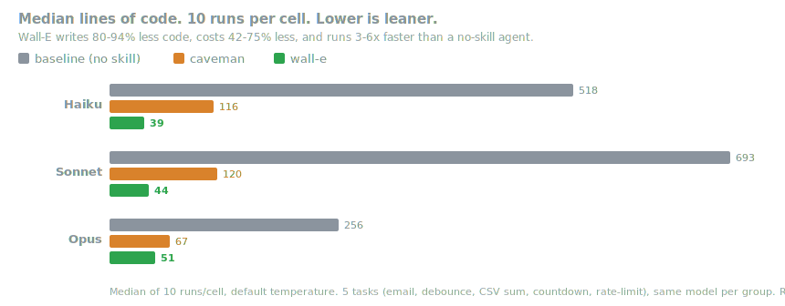

<p align="center">
  <picture>
    <source media="(prefers-color-scheme: dark)" srcset="assets/logo-dark.png">
    
  </picture>
</p>

<h1 align="center">Wall-E</h1>

<p align="center">
  <em>He says nothing. He writes one line. It works.</em>
</p>

<p align="center">
  
  
  
  
  
</p>

<p align="center">
  <a href="https://trendshift.io/repositories/50668" target="_blank" rel="noopener noreferrer"></a>
  <a href="https://trendshift.io/repositories/50668" target="_blank" rel="noopener noreferrer"></a>
</p>

<p align="center">
  <strong>~54% less code (up to 94%) &middot; ~20% cheaper &middot; ~27% faster &middot; 100% safe</strong><br>
  <sub>Measured on real Claude Code sessions editing a real open-source repo (FastAPI + React), against the same agent with no skill. ~54% is the mean across 12 feature tasks (Haiku 4.5, n=4); it reaches 94% where an agent over-builds (a date picker) and is near zero where the code is already minimal. wall-e keeps every safety guard while a bare "write one-liners" prompt drops one. (The earlier single-shot benchmark reported 80-94% as a flat figure; against a fair agentic baseline that is the per-task ceiling, not the average.) <a href="benchmarks/results/2026-06-18-agentic.md">Full writeup</a> &middot; <a href="benchmarks/">reproduce it</a>.</sub>
</p>

<p align="center">
  <sub><a href="README.es.md">Español</a> &middot; <a href="README.ko.md">한국어</a></sub>
</p>

---

> [!NOTE]
> **👀 Something new is coming.** The lazy senior dev has been building something. He won't say what yet.
> **[Be the first to know →](https://ponytail.dev/soon)**

You know him. Long ponytail. Oval glasses. Has been at the company longer than the version control. You show him fifty lines; he looks at them, says nothing, and replaces them with one.

Wall-E puts him inside your AI agent.

## Before / after

You ask for a date picker. Your agent installs flatpickr, writes a wrapper component, adds a stylesheet, and starts a discussion about timezones.

With wall-e:

```html
<!-- wall-e: browser has one -->
<input type="date">
```

More survivors in [examples/](examples/).

## Numbers

The honest measurement is a real agent doing real work: a headless Claude Code session editing [tiangolo's full-stack-fastapi-template](https://github.com/fastapi/full-stack-fastapi-template) (a real FastAPI + React repo), scored on the `git diff` it leaves behind. Twelve feature tickets, the same agent with and without the skill, n=4, Haiku 4.5.

<p align="center">
  
</p>

| vs no-skill baseline | LOC | tokens | cost | time | safe |
|---|--:|--:|--:|--:|--:|
| **wall-e** | **-54%** | **-22%** | **-20%** | **-27%** | **100%** |
| caveman (terse-prose control) | -20% | +7% | +3% | +2% | 100% |
| "YAGNI + one-liners" prompt | -33% | -14% | -21% | -30% | 95% |

wall-e is the only arm that cuts every metric, and the only one that stays fully safe while doing it. The cut is biggest where there is a real over-build trap (date picker 404 to 23 lines, color picker 287 to 23, because it reaches for a native `<input>` instead of a component) and near zero on code that is already minimal. Full method, per-task tables, and limitations: [benchmarks/results/2026-06-18-agentic.md](benchmarks/results/2026-06-18-agentic.md).

<details>
<summary><strong>Older single-shot numbers (isolated generation)</strong></summary>

Five everyday tasks, three models, three arms (no skill, [caveman](https://github.com/JuliusBrussee/caveman), wall-e), ten runs, median reported. One prompt, one completion, counting lines of the answer:

<p align="center">
  
</p>

This showed **80-94% less code**. [#126](https://github.com/DietrichGebert/ponytail/issues/126) fairly pointed out that the bare-model baseline pads its answer with prose and options, so that gap is partly a conversational-baseline artifact. The agentic numbers above are the corrected, defensible version. Reproduce the single-shot run with `npx promptfoo eval -c benchmarks/promptfooconfig.yaml`.

</details>

**The rule was never "fewest tokens."** It is: write only what the task needs, and never cut validation, error handling, security, or accessibility. The code ends up small because it is necessary, not golfed. Lower cost and latency are a side effect on the models that follow the ladder; a terse reasoning model that spends thinking tokens deliberating the rungs can go the other way (on GPT-5.5 it does).

## How it works

Before writing code, the agent stops at the first rung that holds:

```
1. Does this need to exist?   → no: skip it (YAGNI)
2. Already in this codebase?  → reuse it, don't rewrite
3. Stdlib does it?            → use it
4. Native platform feature?   → use it
5. Installed dependency?      → use it
6. One line?                  → one line
7. Only then: the minimum that works
```

The ladder runs *after* it understands the problem, not instead of it: it reads the code the change touches and traces the real flow before picking a rung. Lazy about the solution, never about reading.

Lazy, not negligent: trust-boundary validation, data-loss handling, security, and accessibility are never on the chopping block.

## Install

The most effort wall-e will ever ask of you:

The Claude Code and Codex plugins, and Devin CLI's `.devin/hooks.v1.json`, run two tiny Node.js lifecycle hooks, so `node` needs to be on your PATH (note for Nix/nvm users: it must be on the non-interactive shell's PATH). If it isn't, the skills still work, the always-on activation just stays quiet instead of erroring on every prompt.

### Claude Code

```
/plugin marketplace add DietrichGebert/ponytail
```
```
/plugin install wall-e@wall-e
```
(You have to send two separate prompts for the install to work) 

The desktop app has no `/plugin` command. Install it from the UI instead: Customize, the + by personal plugins, Create plugin and add marketplace, Add from repository, then enter the repo URL (thanks @NiklasDHahn, #98).

### Codex

```bash
codex plugin marketplace add DietrichGebert/ponytail
codex
```

Open `/plugins`, select the Wall-E marketplace, and install Wall-E. Then
open `/hooks`, review and trust its two lifecycle hooks, and start a new thread.

This same install also covers the Codex desktop app: restart the app after installing and it picks up the plugin.

### GitHub Copilot CLI

```bash
copilot plugin marketplace add DietrichGebert/ponytail
copilot plugin install wall-e@wall-e
```

In an interactive Copilot CLI session, use the slash equivalents:

```
/plugin marketplace add DietrichGebert/ponytail
/plugin install wall-e@wall-e
```

Copilot CLI namespaces plugin commands by plugin name. For example:

```text
/wall-e:wall-e ultra
/wall-e:wall-e-review
```

### Pi agent harness

```
pi install git:github.com/DietrichGebert/ponytail
```

### OpenCode

Add to `opencode.json`:

```json
{ "plugin": ["@dietrichgebert/ponytail"] }
```

Run from a checkout instead (the plugin reuses `hooks/` and `skills/`):

```json
{ "plugin": ["./.opencode/plugins/wall-e.mjs"] }
```

Injects the ruleset every turn at the active level; adds the `/wall-e` commands (see [Commands](#commands)). OpenCode also auto-loads this repo's `AGENTS.md`, so the rules hold even without the plugin. The plugin adds the `lite/full/ultra/off` levels.

The `./` path resolves against your project's `opencode.json`; to share one checkout across projects, point it at the absolute path of the `.mjs` instead (it finds its `hooks/` and `skills/` relative to its own file).

### Gemini CLI

```bash
gemini extensions install https://github.com/DietrichGebert/ponytail
```

Loads the ruleset as always-on context every session and registers the `/wall-e` commands; the `skills/` ship too, activated when a task needs them.
The Gemini adapter intentionally does not ship a root `hooks/hooks.json`: Gemini auto-loads that path, while Wall-E's lifecycle hooks use Claude/Codex event names.

### Antigravity CLI

Google is renaming Gemini CLI to Antigravity CLI (the `agy` binary); the same extension installs there:

```bash
agy plugin install https://github.com/DietrichGebert/ponytail
```

It reuses this repo's `gemini-extension.json`. One difference: Antigravity converts the `/wall-e` commands into skills, so you type them into the chat (e.g. `/wall-e-review` as a message) instead of picking them from a slash menu. Until the migration completes (around June 18, 2026), `gemini extensions install` still works too. To run it as an always-on rule instead, drop the ruleset into `.agents/rules/`.

### Devin CLI

Reads [`AGENTS.md`](AGENTS.md) from the project root automatically, zero setup.

Running from a checkout of this repo also picks up [`.devin/hooks.v1.json`](.devin/hooks.v1.json), which reuses the same `hooks/` scripts as Claude Code and Codex (Devin's hook format is Claude Code-compatible): session-start ruleset injection at the active level, plus mode tracking on every prompt — use `@wall-e lite|full|ultra|off` (the `@` prefix sidesteps Devin's own slash-command handling, since `/wall-e` isn't a command Devin knows about here). Devin CLI's plugin system currently only bundles skills, not hooks, so outside a checkout you get the `AGENTS.md` rule without the mode switches.

### CodeWhale

Reads `AGENTS.md` from the project root, zero setup. Copy [`AGENTS.md`](AGENTS.md) to your project, or run `codewhale` from a checkout of this repo. That's it.

### Swival

Stage the collection in your library first, then add the skills you want:

```bash
swival skills add --global https://github.com/DietrichGebert/ponytail  # stage into ~/.config/swival/library
swival skills add wall-e                                             # install the collection into this project
swival skills add --global wall-e                                    # or activate it in every project
```

Swival also reads `AGENTS.md` from the project root and `~/.config/swival/AGENTS.md` globally, the instruction-only fallback.

On the command line, use a `$` prefix to explicitly activate a skill. For example: `$wall-e-review`.

### OpenClaw

```bash
clawhub install wall-e
```

Installs wall-e as an OpenClaw skill from ClawHub; the review, audit, debt, gain, help, and end-of-session skills install the same way (`clawhub install wall-e-review`, and so on). OpenClaw applies it on coding tasks and also exposes it as a `/wall-e` command. Without ClawHub, copy [`.openclaw/skills/wall-e`](.openclaw/skills/) into `~/.openclaw/skills/`.

That was it. He'd be proud. He won't say it.

Active every session, with a handful of commands (see [Commands](#commands)). `/wall-e ultra` exists for when the codebase has wronged you personally. Startup and mode-change text shows the current mode.

Set the level for every new session with the `WALLE_DEFAULT_MODE` env var (`lite`/`full`/`ultra`/`off`), or a `defaultMode` field in `~/.config/wall-e/config.json` (`%APPDATA%\wall-e\config.json` on Windows). The default is `full`.

Cursor, Windsurf, Cline, GitHub Copilot (editor), Aider, Kiro, Zed, CodeWhale, Swival: copy the matching rules file from this repo ([`.cursor/rules/`](.cursor/rules/), [`.windsurf/rules/`](.windsurf/rules/), [`.clinerules/`](.clinerules/), [`.github/copilot-instructions.md`](.github/copilot-instructions.md), [`AGENTS.md`](AGENTS.md), [`.kiro/steering/`](.kiro/steering/)).

Kiro: copy `.kiro/steering/wall-e.md` to `~/.kiro/steering/` (global) or `.kiro/steering/` in your project.

GitHub Copilot CLI fallback (instruction-only mode): it reads `AGENTS.md` and `.github/copilot-instructions.md` in a project, or copy the rules into `~/.copilot/copilot-instructions.md` to run wall-e in every project. This path keeps always-on guidance, but does not add plugin mode switches or hooks.

VS Code with the Codex extension reads `AGENTS.md`, which this repo ships, so it works from the repo root with no setup (`~/.codex/AGENTS.md` makes Codex global).

Which files map to which agent: [Agent portability](docs/agent-portability.md).

### Uninstall

| Host | Command |
|------|---------|
| Claude Code | `/plugin remove wall-e` |
| Codex | `codex plugin remove wall-e` |
| Pi agent | `pi uninstall wall-e` |
| Cursor / Windsurf / Cline / etc. | Delete the copied rule file |

These remove the plugin's own files. They leave behind a small amount of state wall-e writes outside the plugin folder: the mode flag, `~/.config/wall-e/config.json`, and (if you accepted the setup nudge) a `statusLine` entry in `~/.claude/settings.json`. Run `node scripts/uninstall.js` to clean those up too. **Run it before the host remove command above** — the script is itself a plugin file, so removing the plugin first deletes it (or run it from a separate clone of this repo). It only removes the statusLine entry if it points at wall-e's own script, so a statusline you set up yourself is left untouched.

## Commands

| Command | What it does |
|---------|--------------|
| `/wall-e [lite \| full \| ultra \| off]` | Set the intensity, or turn it off. No argument reports the current level. |
| `/wall-e-review` | Review the current diff for over-engineering, hands back a delete-list. |
| `/wall-e-audit` | Audit the whole repo for over-engineering, not just the diff. |
| `/wall-e-debt` | Harvest the `wall-e:` shortcuts you've deferred into a ledger, so "later" doesn't become "never". |
| `/wall-e-gain` | Show the measured impact scoreboard (less code, less cost, more speed) from the benchmark. |
| `/wall-e-help` | Quick reference for the commands above. |
| `/end-of-session` | Clean up the workspace before handoff or commit: inspect status, commit/stash, update `.gitignore`, scan for secrets, run checks. |

Commands need a skill-capable host (Claude Code, Codex, OpenCode, Gemini, pi, Swival). In Codex they're skills, invoke with `@` (`@wall-e-review`). The instruction-only adapters (Cursor, Windsurf, Cline, Copilot, Kiro, Antigravity) load the always-on ruleset without the commands. Devin CLI (checkout only) tracks the `/wall-e` level switch via `.devin/hooks.v1.json` but has no skill-based commands.

## Development

When changing the compact rule text, keep the agent copies aligned:

```bash
node scripts/check-rule-copies.js
npm test
```

The OpenClaw skill package (`.openclaw/skills/`) is generated from `skills/`; rerun `node scripts/build-openclaw-skills.js` after changing a skill, the test suite fails if it is stale. To publish the skills to ClawHub, run `clawhub login` once, then `node scripts/publish-openclaw-skills.js` (it publishes all seven at the `package.json` version; pass `--dry-run` to preview).

The correctness benchmark spawns Python for email and CSV checks; `python3` is tried before `python`. CSV checks need `pandas` installed locally.

## FAQ

**Does it need a config file?**
No. An optional `~/.config/wall-e/config.json` or `WALLE_DEFAULT_MODE` env var can set the default level, but nothing is required.

**What if I really need the 120-line cache class?**
You don't. Insist anyway and he'll build it. Slowly. Correctly. While looking at you.

**Does it scale?**
The code you never wrote scales infinitely. Zero bugs, zero CVEs, 100% uptime since forever.

**Why "wall-e"?**
You know exactly why.

## License

[MIT](LICENSE). The shortest license that works.

## Star History

<a href="https://www.star-history.com/dietrichgebert/ponytail#history">
 <picture>
   <source media="(prefers-color-scheme: dark)" srcset="https://api.star-history.com/chart?repos=DietrichGebert/ponytail&type=Date&theme=dark" />
   <source media="(prefers-color-scheme: light)" srcset="https://api.star-history.com/chart?repos=DietrichGebert/ponytail&type=Date" />
   
 </picture>
</a>
