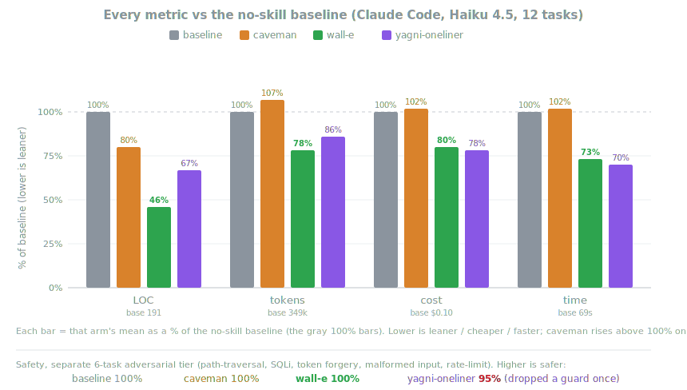

<p align="center">
  <picture>
    <source media="(prefers-color-scheme: dark)" srcset="assets/logo-dark.png">
    
  </picture>
</p>

<h1 align="center">Wall-E</h1>

<p align="center">
  <em>He says nothing. He writes one line. It works.</em>
</p>

<p align="center">
  
  
  
</p>

<p align="center">
  <strong>~54% less code &middot; ~20% cheaper &middot; ~27% faster &middot; 100% safe</strong>
</p>

You know him. Long ponytail. Oval glasses. Has been at the company longer than the version control. You show him fifty lines; he looks at them, says nothing, and replaces them with one.

Wall-E puts him inside your AI agent.

## Before / after

You ask for a date picker. Your agent installs flatpickr, writes a wrapper component, adds a stylesheet, and starts a discussion about timezones.

With wall-e:

```html
<!-- wall-e: browser has one -->
<input type="date">
```

More platform-native shortcuts in [docs/platform-native.md](docs/platform-native.md).

## Numbers

Measured on real Claude Code sessions editing a real FastAPI + React repo. The biggest wins are where an agent over-builds (e.g., a date picker → `<input type="date">`); near zero where the code is already minimal.

<p align="center">
  
</p>

| vs no-skill baseline | LOC | tokens | cost | time | safe |
|---|--:|--:|--:|--:|--:|
| **wall-e** | **-54%** | **-22%** | **-20%** | **-27%** | **100%** |
| caveman (terse-prose control) | -20% | +7% | +3% | +2% | 100% |
| "YAGNI + one-liners" prompt | -33% | -14% | -21% | -30% | 95% |

## How it works

Before writing code, the agent stops at the first rung that holds:

```
1. Does this need to exist?   → no: skip it (YAGNI)
2. Already in this codebase?  → reuse it, don't rewrite
3. Stdlib does it?            → use it
4. Native platform feature?   → use it
5. Installed dependency?      → use it
6. One line?                  → one line
7. Only then: the minimum that works
```

The ladder runs *after* it understands the problem, not instead of it: it reads the code the change touches and traces the real flow before picking a rung.

Lazy, not negligent: trust-boundary validation, data-loss handling, security, and accessibility are never on the chopping block.

## Install

The Claude Code and Codex plugins, and Devin CLI's `.devin/hooks.v1.json`, run two small Node.js lifecycle hooks, so `node` needs to be on your PATH. If it isn't, the skills still work; the activation just stays quiet.

### Claude Code

```
/plugin marketplace add InkRL/wall-e
```
```
/plugin install wall-e@wall-e
```

You have to send two separate prompts for the install to work.

The desktop app has no `/plugin` command. Install it from the UI instead: Customize, the + by personal plugins, Create plugin and add marketplace, Add from repository, then enter the repo URL `https://github.com/InkRL/wall-e`.

### Codex

```bash
codex plugin marketplace add InkRL/wall-e
codex
```

Open `/plugins`, select the Wall-E marketplace, and install Wall-E. Then open `/hooks`, review and trust its two lifecycle hooks, and start a new thread.

### GitHub Copilot CLI

```bash
copilot plugin marketplace add InkRL/wall-e
copilot plugin install wall-e@wall-e
```

In an interactive Copilot CLI session, use the slash equivalents:

```
/plugin marketplace add InkRL/wall-e
/plugin install wall-e@wall-e
```

Copilot CLI namespaces plugin commands by plugin name. For example:

```text
/wall-e:wall-e ultra
/wall-e:wall-e-review
```

### Devin CLI

Reads `AGENTS.md` from the project root automatically, zero setup.

Running from a checkout of this repo also picks up `.devin/hooks.v1.json`, which reuses the same `hooks/` scripts as Claude Code and Codex (Devin's hook format is Claude Code-compatible): session-start ruleset injection at the active level, plus mode tracking on every prompt. Use `@wall-e lite|full|ultra|off` in Devin (the `@` prefix sidesteps Devin's own slash-command handling).

### Other agents

Copy `AGENTS.md` to your project root. That's the instruction tier.

## Commands

| Command | What it does |
|---------|--------------|
| `/wall-e [lite \| full \| ultra \| off]` | Set the intensity, or turn it off. No argument reports the current level. |
| `/wall-e-review` | Review the current diff for over-engineering. |
| `/wall-e-audit` | Audit the whole repo for over-engineering. |
| `/wall-e-debt` | Harvest the `wall-e:` shortcuts you've deferred into a ledger. |
| `/wall-e-gain` | Show the measured impact scoreboard. |
| `/wall-e-help` | Quick reference. |
| `/end-of-session` | Clean up the workspace before handoff or commit. |

Commands need a skill-capable host (Claude Code, Codex, GitHub Copilot CLI). Devin CLI tracks the `/wall-e` level switch via hooks but has no skill-based commands.

## Development

When changing the compact rule text, keep the agent copies aligned:

```bash
node scripts/check-rule-copies.js
node --test tests/*.test.js
```

## FAQ

**Does it need a config file?**
No. An optional `~/.config/wall-e/config.json` or `WALLE_DEFAULT_MODE` env var can set the default level, but nothing is required.

**What if I really need the 120-line cache class?**
You don't. Insist anyway and he'll build it. Slowly. Correctly. While looking at you.

**Does it scale?**
The code you never wrote scales infinitely.

**Why "wall-e"?**
You know exactly why.

## License

[MIT](LICENSE). The shortest license that works.
